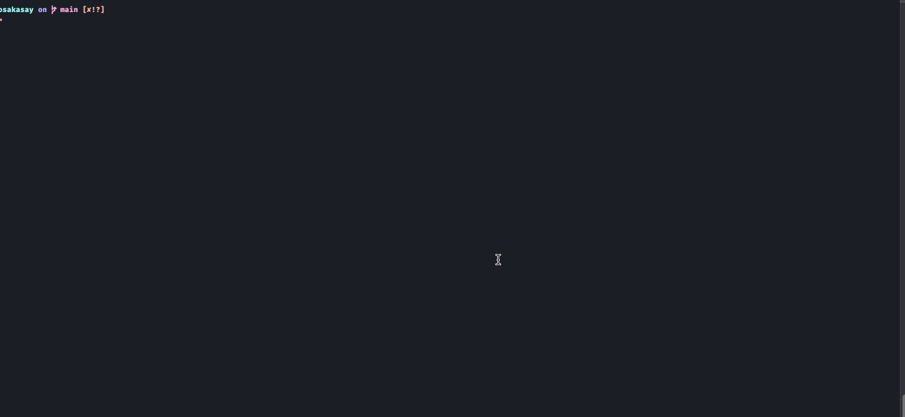

# Osakasay
*A CLI program written in C featuring talking Saiba Ayumi "Osaka" Kasuga from Azumanga Daioh

[](LICENSE)
[]()

---

## Preview

Example of usage



## Features
- Talking ASCII art of Osaka
- Freestyle changing animation of Osaka

## Installation

#### disclaimer
Sometimes the precompiled binaries are not the latest version as the release. If you want to make sure that you got the latest version, you can built it from source. You can check the versions of the compiled binaries in the `/bin` folders.

### Linux
```bash
git clone https://github.com/oliveira-andre/osakasay.git
cd Osakasay
sudo sh ./install/linux.sh
```
### MacOS
```bash
git clone https://github.com/oliveira-andre/osakasay.git
cd Osakasay
sudo sh ./install/mac.sh
```
### Build from source (Latest Version)
```bash
git clone https://github.com/oliveira-andre/osakasay.git
cd Osakasay
make
```

## Usage
```bash
osakasay --help         # Show help
osakasay <text>         # Simple Usage
osakasay -a             # Animated Osaka with no text bubble (default version 1)
osakasay -a <version>   # Animated Osaka with no text bubble (default version 1)
osakasay -f             # Freestyle animations (This is pretty cool for ricing)
```

## File Structure
```
repo/
├── bin/ 
│    ├── linux/
│    │   ├── version.txt
│    │   └── osakasay
│    └── mac/
│        ├── version.txt 
│        └── osakasay
├── install/
│    ├── mac.sh
│    └── linux.sh
├── src/
│    ├── art/
│    │   ├── art.c
│    │   └── art.h
│    └── osakasay.c
├── Makefile
├── LICENSE
├── preview.gif
└── README.md
```
